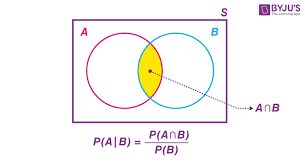

# The prior probability
$P(A)$ is the probability of an incident occurs.And it also named priori probability

Now we konw what is priori probability then what is posterior probability?  
that must be a little dificult lets just start by class-conditional probability  

$P(AB)$ is the probability of an incident that both $A$ and $B$ occurs,which is easy to unserstand.  
Now we can give out class-conditional probability $P(A|B)$ which is the probability incident $A$ occurs in the case of $B$ happened  and it can be also called `likelihood`

And here is a pictuer that intimately shows what class-conditional probability is.  

  

the expression $P(A \cup B)$ is as same as the expression $P(AB)$

according the following expression
$$ P(A|B) = \frac{P(AB)} {P(B)}$$
but the probability of $P{AB}$ is not easy to estimate so we reform the expression get the following expression
$$ P(A|B) = \frac{P(A)P(B|A)} {P(B)}$$
and we can reformat if futhter more
$$ P(A|B) = \frac{P(A)P(B|A)} {\sum_A P(A)P(B|A)}$$
up to now we can use the probability of $P(A)$ and probability of $P(B|A)$ to estimate the probability of $P(A|B)$
what we do is just estimate the probability of $A$ and probability $B$ present in $A$ then we can estimate the probability of $A$ given the probability of $B$ 

finall we can write the following expression
$$ posterior = \frac{prior \cdot likelihood} {evidence} $$ 
