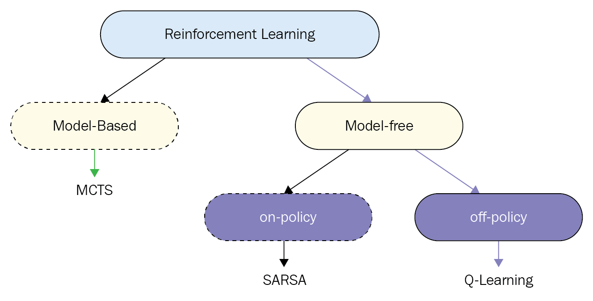

# where is on policy or off policy

on policy and off policy is a branch of model-free

the grapth is intimatly shows below

== The Model in the image means the probability of state transition ==

while for model-free based algorithm we don't have the probability of state transition.So we have to estimate it using other method

# 
